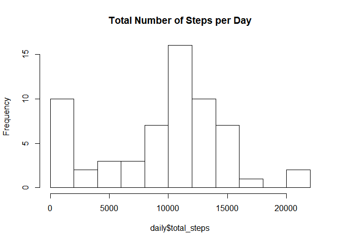
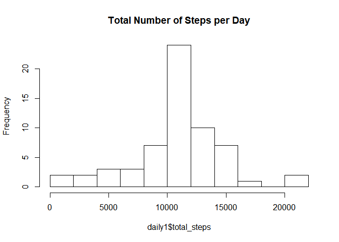
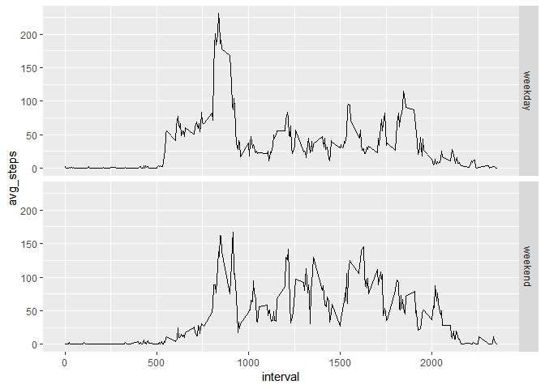

For the project we need some libraries 


```r
library(readr)
library(tidyverse)
```

```
## -- Attaching packages ------------------------------- tidyverse 1.2.1 --
```

```
## v ggplot2 3.1.0       v purrr   0.3.2  
## v tibble  2.1.1       v dplyr   0.8.0.1
## v tidyr   0.8.3       v stringr 1.4.0  
## v ggplot2 3.1.0       v forcats 0.4.0
```

```
## Warning: package 'tibble' was built under R version 3.5.3
```

```
## Warning: package 'tidyr' was built under R version 3.5.3
```

```
## Warning: package 'purrr' was built under R version 3.5.3
```

```
## -- Conflicts ---------------------------------- tidyverse_conflicts() --
## x dplyr::filter() masks stats::filter()
## x dplyr::lag()    masks stats::lag()
```


## Loading and preprocessing the data

First the source data is unzipped to the data directory


```r
zipFile <- "./activity.zip"
dataPath <- "./data"
if (!file.exists(dataPath)) {
    unzip(zipFile, exdir = dataPath)
}
```
We read the data and parse the date format: 


```r
activity <- read_csv("data/activity.csv", 
    col_types = cols(date = col_date(format = "%Y-%m-%d"), 
        steps = col_double()))
```


## What is mean total number of steps taken per day?

We calculate the total number of steps by day and draw a histogram: 


```r
daily <- activity %>%
    group_by(date) %>%
    summarise(total_steps = sum(steps, na.rm = TRUE))
hist(daily$total_steps, breaks = 10,
     main = "Total Number of Steps per Day")
```

<!-- -->


```r
mtns <- mean(daily$total_steps)
mtns
```

```
## [1] 9354.23
```

```r
medtns <- median(daily$total_steps)
medtns
```

```
## [1] 10395
```

The mean total number of steps taken per day is **9354**, the median is at **10395**.


## What is the average daily activity pattern?

Averaging steps per intervall over all available days shows us the average activity pattern:


```r
pattern <- activity %>%
    group_by(interval) %>%
    summarise(avg_steps = mean(steps, na.rm = TRUE))
with(pattern, plot(x=interval, y = avg_steps, type = "l"))
```

<!-- -->


```r
most_act <- pattern[which.max(pattern$avg_steps),]
most_act
```

```
## # A tibble: 1 x 2
##   interval avg_steps
##      <dbl>     <dbl>
## 1      835      206.
```

The most active interval is the one at **835** seconds with ~**206 steps**.


## Imputing missing values

To fill NA gaps we will replace them by the mean of the respective interval, which we have already available as the "overall activity pattern" (variable: pattern).


```r
activity1 <- activity

for(r in 1:nrow(activity1)){
    if(is.na(activity1$steps[r])) {
        activity1$steps[r] <- 
            pattern[which(pattern$interval == activity1$interval[r]),]$avg_steps
    }
}

sum(is.na(activity1$steps))
```

```
## [1] 0
```

The new data set doe not contain NA's anymore. So we draw again a histogram ...


```r
daily1 <- activity1 %>%
    group_by(date) %>%
    summarise(total_steps = sum(steps, na.rm = TRUE))
hist(daily1$total_steps, breaks = 10,
     main = "Total Number of Steps per Day")
```

<!-- -->

... and calculate mean and median:


```r
mtns1 <- mean(daily1$total_steps)
mtns1
```

```
## [1] 10766.19
```

```r
medtns1 <- median(daily1$total_steps)
medtns1
```

```
## [1] 10766.19
```

The mean total number of steps taken per day is **10766**, the median is at **10766**.


## Are there differences in activity patterns between weekdays and weekends?

First we caclulate the day and whether it is a weekday or weekend and reproduce the activity pattern for each:


```r
activity1 <- activity1 %>%
    mutate(day = weekdays(date), 
           daytype = ifelse(day %in% c("Montag", "Dienstag",
                                       "Mittwoch", "Donnerstag",
                                       "Freitag"), 
                            "weekday", "weekend"))

pattern1 <- activity1 %>%
    group_by(interval, daytype) %>%
    summarise(avg_steps = mean(steps, na.rm = TRUE))
```

Finally, we plot the different patterns:


```r
ggplot(data = pattern1, aes(interval, avg_steps)) +
    geom_line()  +
    facet_grid(daytype ~ .)
```

<!-- -->


